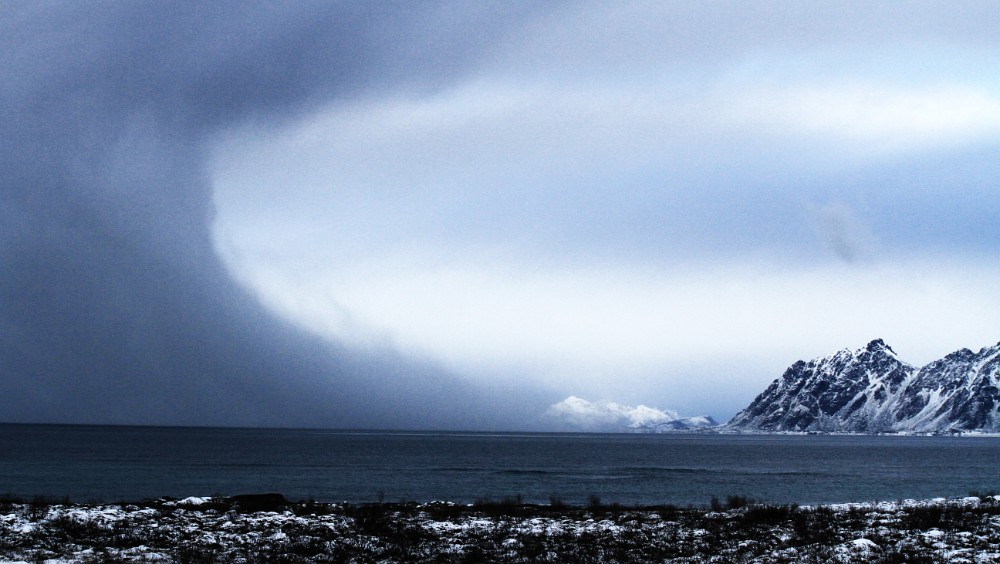
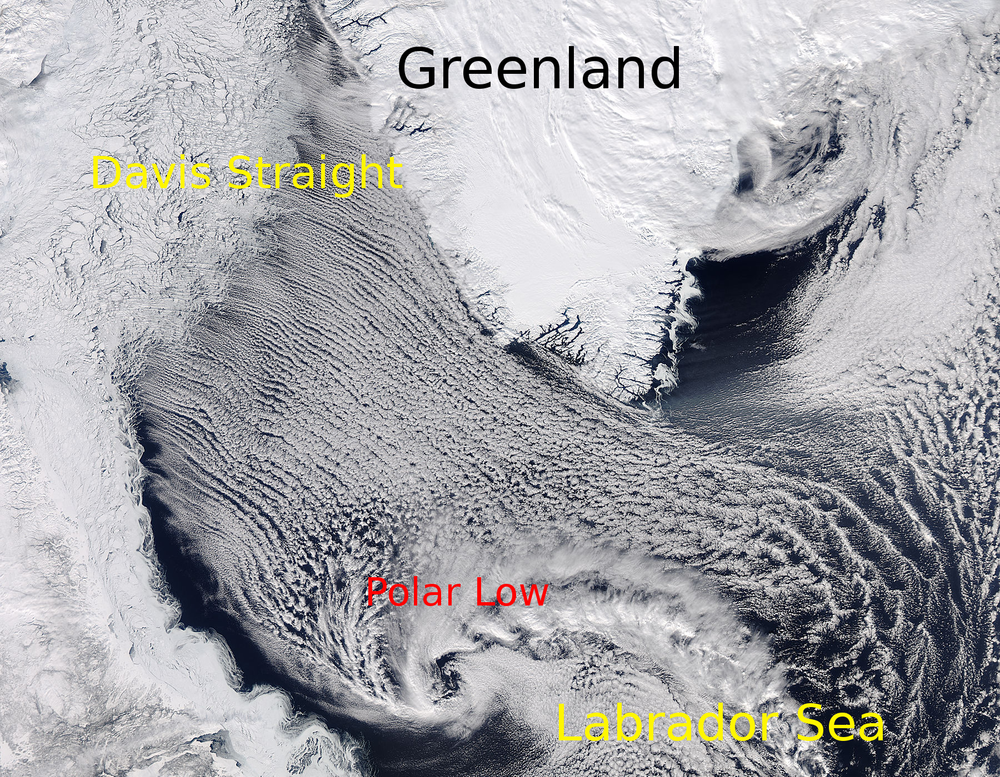
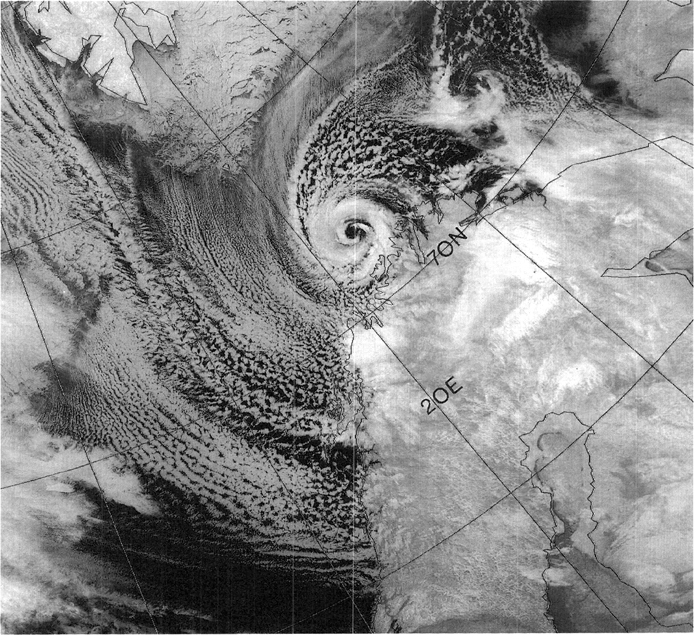
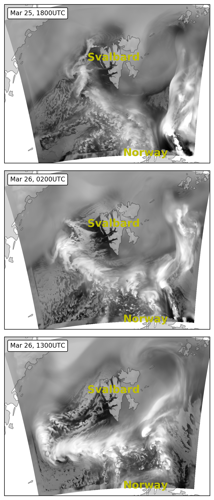
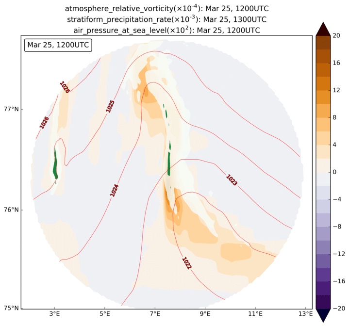
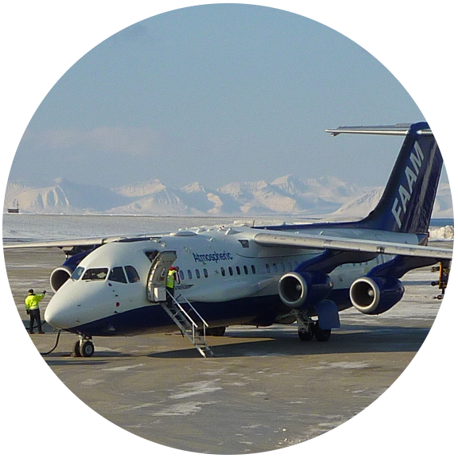
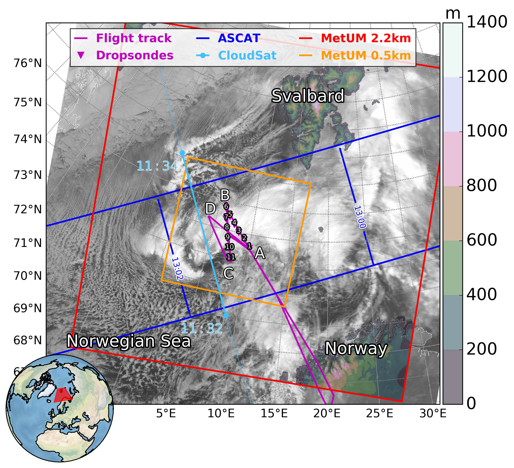
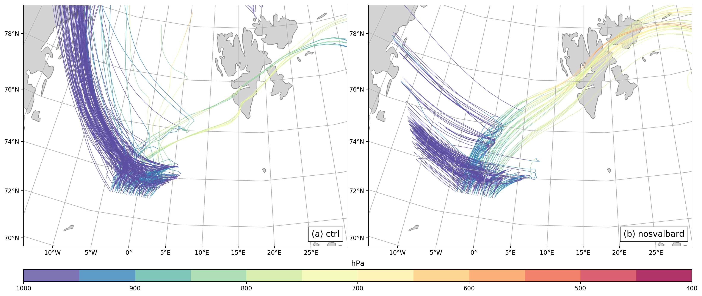
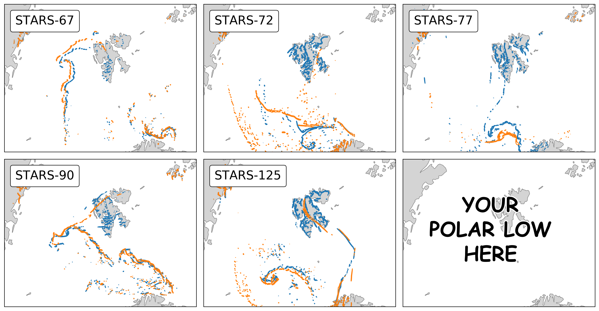

# What are polar lows? 

<blockquote>
<em>Polar lows</em> are small (<b>100–500 km</b> in diameter), short-lived maritime depressions with near-surface winds exceeding <b>15 m/s</b>
</blockquote>
<ul  style="font-size: 90%">
<li>A hazard to ships, oil rigs and coastal communities in the Arctic, North Atlantic and North Pacific</li>
<li>Typical conditions give an [estimate](http://www.scisnack.com/2015/03/04/polar-lows-what-fuels-arctic-hurricanes/) of $10^{18} J$ of the total <b>kinetic energy</b> $\approx$ 100 thunderstorms.</li>
</ul>

  
  
<a href="http://www.nrk.no/nordland/polart-lavtrykk-inn-mot-nordland-natt-til-sondag-1.12112660">NRK.no</a>

 

  
  
<a href="http://www.sat.dundee.ac.uk">NERC Satellite Receiving Station</a>

  
  
<a href="https://twitter.com/Meteorologene">MET Norway</a>

  
  
<a href="http://www.atmos.rcast.u-tokyo.ac.jp/hotspot/eng/selected2/a01_k1.html">U. Tokyo</a>

<aside class="notes">
* Their main energy sources are: air-sea heat fluxes, condensational heating; available potential and kinetic energy of large-scale flow.
</aside>

<!-- #

  

-->

# Where do polar lows occur? 

  
  
<a href="http://www.sat.dundee.ac.uk">NERC Satellite Receiving Station</a>

<aside class="notes">
* Typically in the regions prone to CAOs, where relatively cold continental air is advected over warm ice-free waters.
* A perfect example of CAO is manifested by the long parallel cloud streets in this image.
* Down south, the edge of CAO curls up in a cyclone, which continues to draw energy from the ocean surface
</aside>

# Where do polar lows occur?

* <b>Cold-air outbreaks</b> occur in the North Atlantic, resulting in
* Hundreds of small mesoscale cyclones per year in each region
* There, dozens of <b>intense</b> polar lows develop mostly in **winter**

 

  
  
<a href="https://twitter.com/Meteorologene">MET Norway</a>

  
  
<a href="https://www.barentswatch.no/en/articles/polar-lows-explained/">BarentsWatch</a>

<aside class="notes">
* There are some favourable locations for the CAO and polar lows.
* Satellite-based climatological studies show that there are typically hundreds od PMCs per year
* Each blue triangle in this figure shows a polar low location
</aside>

# "The most beautiful polar low"

  
[Nordeng and Rasmussen, 1992]

  

#

  

  <h6 style="font-size:50%;">(not so beautiful)</h6>
  <h3>Example from March 2013</h3>
  
Along the cyclone track:

  
  
vorticity ($10^{-4}$ $s^{-1}$), pressure ($hPa$), precipitation ($g$ $m^{-2}$)

<aside class="notes">
* This slide shows an example of a polar low that developed over the Norwegian Sea in late March 2013
* You can either look at the evolution of the clouds on the right (time goes from top to the bottom row)
* On the left the same PL is shown following the track
* The northerly flow converged into a line of high cyclonic vorticity (brownish colours)
* It was undulating and producing small instability waves
* The vorticity filament bent in half and curled up into a PL
* Later, the PL broke down into a bunch of smaller disturbances
* Its remnants were absorbed by a new stronger PL that formed close to the coast of Norway.
</aside>

# Observations

  <ul>
  <li>Data were gathered instrumented <b>aircraft</b> and <b>dropsondes</b> during ACCACIA field campaign</li>
  </ul>
  

  

  

  
  
$+$ satellite data: AVHRR, CloudSat, ASCAT

<aside class="notes">
* So why is this case worth investigating? 
* This type of polar low is frequent in the region, though many studies focused more on hurricane-like polar lows
* From a pragmatic point of view, we have a lot of observations, because it was probed by instrumented aircraft during the ACCACIA field campaign (purple line on the map)
* And this is valuable: even today, there are only about a dozen of PLs directly observed with aircraft
</aside>

# Flying through the cloud wall

  

  <video src="media/shear_line_flight.mp4" width="100%" muted controls></video>

<aside class="notes">
* So what does it look like to fly on an airplane through a cloud wall of a polar low?
* Dramatic change in weather conditions
* You can witness the windy and stormy conditions in the cold air mass, but as the aircraft crosses the cloud wall, the atmosphere becomes very calm and clear.
</aside>

# ACCACIA Polar Low: MODIS picture
<!--{data-transition="fade-out convex-in"}-->

  
  
NEODAAS NERC Satellite Receiving Station, Dundee University

<aside class="notes">
* Not only we used the aircraft and satellite observations (such as this impressive MODIS RGB image)
* we also ran the Met Office numerical model
</aside>

# Met Office Unified Model simulation

  

<aside class="notes">
  
The 3D image from the model shows how the polar low is forming on the edge of a CAO

  
Temperature contrast is indicated by blue‐orange colours

  
Following the green vectors of the wind field, you can see the dramatic change in wind speed

  
The model also reproduced the convective clouds (white colours)

</aside>

#
<blockquote>The <b>Met Office Unified Model</b> reproduced the polar low reasonably well</blockquote>

more info in this paper:

<!--<iframe id="pdfDocument" src="media/paper.pdf" style="width:100%; height: 400px;"></iframe>-->
$$\Downarrow$$

<blockquote>We use it in further analysis of the polar low</blockquote>

#
<h1 style="font-size: 300%; margin: 100px 0 70px 0;">Current research</h1>

# Does geography play a role in polar low formation?

Hypothesis 1:
<blockquote>Svalbard's orography deflects the northerly flow</blockquote>
$$\Downarrow$$
<blockquote>Let's remove Svalbard!</blockquote>

Hypothesis 2:
<blockquote>Several studies indicate that sea ice extent plays a significant role</blockquote>
$$\Downarrow$$
<blockquote>Let's change the sea ice edge!</blockquote>

<h3 style="font-size: 120%">Why is this important?</h3>
* Climate change in the Arctic can lead to a dramatic sea ice retreat
* It is still uncertain how it will affect polar low climatology

<aside class="notes">
* In the final part of my talk I will focus on the role of surface conditions in polar low life cycle
* When I looked at the clouds and convergence line in the lee of Svalbard, it seemed that the northerly flow was deflected by Svalbard
* So I decided to change the orography mask in the model and see what happens
* I started with lowering the Svalbard mountains by a certain factor
* Then I got angry and just purged Svalbard from the land mask completely
</aside>

# 

<blockquote class="twitter-tweet" data-lang="en">
Satellittbildet over <a href="https://twitter.com/hashtag/Svalbard?src=hash">#Svalbard</a> viser et hjerteformet hull i skylaget. Ikke verst for de som får se sola gjennom et hjerte ❤️ <a href="https://t.co/q4sWjMWIvB">pic.twitter.com/q4sWjMWIvB</a>
&mdash; Meteorologene (@Meteorologene) <a href="https://twitter.com/Meteorologene/status/869830858345205760">May 31, 2017</a></blockquote>

# (1) Experiment without Svalbard

  

* Surface altitude of Svalbard is set to 0
* Sea ice is the same as in the control (CTRL) run

# (1) without Svalbard
* Removing Svalbard has little impact on the polar low development
* Shown are contours of vorticity ($\zeta>=10^{-3} s^{-1}$) at 950 hPa

  

# (1) Polar low (CTRL run): isosurface of vorticity
<iframe src="media/scene/accacia.html" class="stretched" style="height:1500px; width:1900px"></iframe>

<aside class="notes">
* The air flows from the ice fields of the North and then curls up in a cyclone (green arrows)
* The cyclonic circulation can be visible in the white streamlines
* The more air flow changes speed and direction, the higher the vorticity is - shown by dark blue isosurfaces
</aside>

# (1) How is it reflected in the backward trajectories?
* We use LAGRANTO model to calculate trajectories **backward in time**, starting **from the polar low centre**
* Trajectories are coloured by **pressure**
* Shown here are only those that ended up in the **boundary layer**

  

<aside class="notes">

Very few trajectories pass over Svalbard

The majority of air parcels that ended up in the PL sector have north and north-west origin

Atmospheric pressure does not change significantly along a single trajectory, implying the mesocyclones formed without interaction with the upper troposphere.

Air from the Svalbard region moves mostly within mid-tropospheric levels

</aside>

# (2) Experiment with straight sea ice edge

  

* Surface altitude of Svalbard is the same as in CTRL
* Sea ice edge is a straight line

# (2) with straight sea ice edge
* Perturbing ice cover has bigger impact: the cyclone is displaced more

  

# (3) Experiment without Svalbard AND with straight sea ice edge

  

* Surface altitude of Svalbard is set to 0
* Sea ice edge is a straight line

# (3) without Svalbard AND with straight sea ice edge
* 2 factors combined result in the biggest difference compared to CTRL

  

# Summary of sensitivity experiments

  

 

* The existence of the polar low is determined by the atmospheric dynamics
* <em>But</em> the exact location and shape is influenced by surface factors
* Sea ice cover is more important than orography

<aside class="notes">
* For a typical "merry-go-round" polar low 
* Real-life polar lows are a mess, but MetUM simulates them well
</aside>

# Future plans
* Run the model for other polar low cases (<a href="http://polarlow.met.no/stars-dat/">STARS database</a>)
* Investigate how <em>exactly</em> the sea ice cover affects polar low dynamics
 

  

# Thanks!

Questions?

<ul class="icon-list">
  <li><a href="https://twitter.com/meteodenny"><i class="fa fa-twitter -square fa-lg"></i>Twitter: meteodenny</a></li>
  <li><a href="https://github.com/dennissergeev"><i class="fa fa-github -square fa-lg"></i>GitHub: dennissergeev</a></li>
  <li><a href="https://dennissergeev.github.io"><i class="fa fa-globe -square fa-lg"></i>Website: dennissergeev.github.io</a></li>
  <li><a href="https://dennissergeev.github.io/gfi2017"><i class="fa fa-play-circle -square fa-lg"></i>This presentation: https://dennissergeev.github.io/gfi2017</a></li>
</ul>
 

 

<!--
-->
